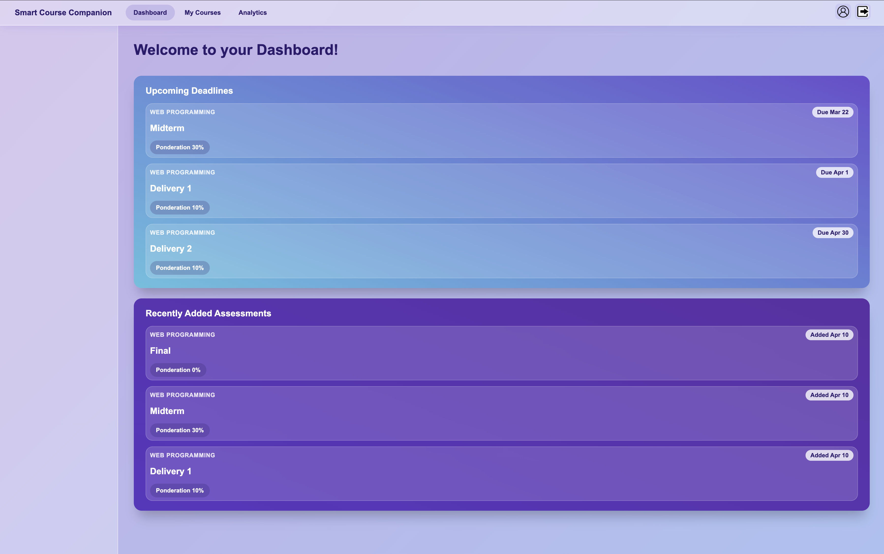
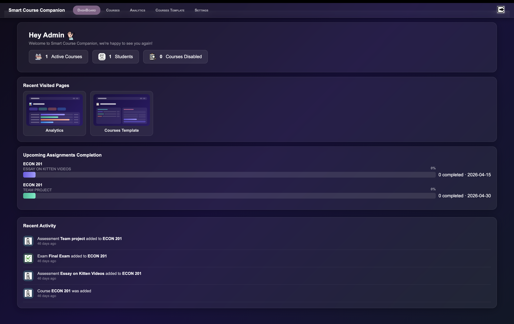
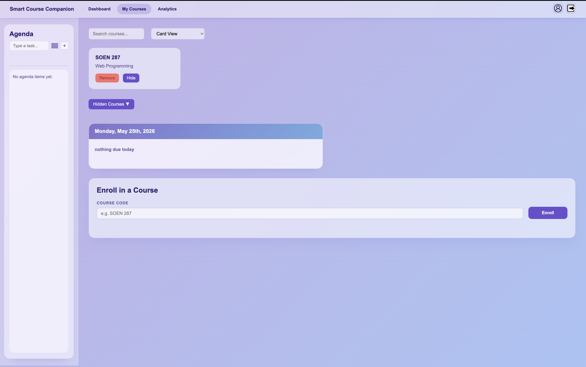
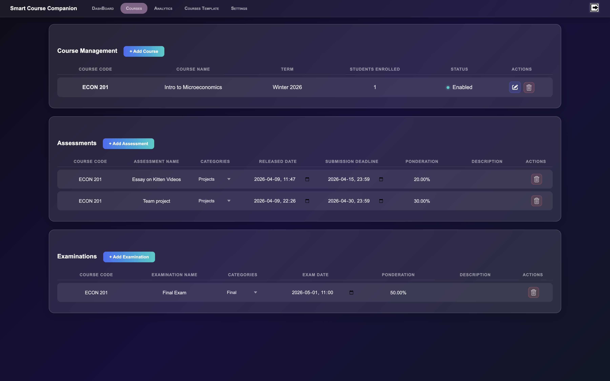

# Smart-Course-Companion

# Smart Course Companion

> Academic full-stack project developed for SOEN 287 using Node.js, Express.js, and MySQL.

Smart Course Companion is a full-stack academic management platform designed to help students and administrators manage courses, grades, assessments, analytics, and academic progress through an interactive dashboard system.

---

# Features

## Student Features
- Secure student authentication
- Dashboard overview
- Course enrollment tracking
- Grade management
- Academic analytics
- Assessment progress tracking
- Personal agenda/task management
- Account management

## Admin Features
- Secure admin authentication
- Course creation and management
- Student management
- Assessment template management
- Grade management
- Analytics dashboards

## System Features
- Session-based authentication
- REST API architecture
- Dynamic database schema initialization
- CSV/PDF export functionality
- Flash messaging
- Modular backend architecture
- MySQL database integration

---

# Screenshots

## Student Dashboard


## Admin Dashboard


## Course Management
Student's Side


Admin's Side


---
# How It Works

1. Users authenticate through the login system.
2. Express sessions maintain authenticated state.
3. Students can access enrolled courses, grades, and analytics.
4. Admins can create courses and manage assessments.
5. MySQL stores all persistent academic data.
6. REST APIs handle communication between frontend and backend.

---

# Tech Stack

## Backend
- Node.js
- Express.js
- MySQL
- Express Session
- bcrypt
- dotenv
- CORS
- PDFKit
- json2csv

## Frontend
- HTML
- CSS
- JavaScript

## Database
- MySQL (`mysql2`)

---

# Development Challenges

Some challenges encountered during development included:

- Designing a scalable relational database schema
- Managing session authentication securely
- Organizing backend routes and controllers cleanly
- Handling schema updates dynamically
- Structuring a maintainable full-stack project architecture

---

# Project Structure

```text
Smart-Course-Companion/
│
├── controllers/
│   ├── authController.js
│   └── settingsController.js
│
├── middleware/
│   ├── auth.js
│   └── validate.js
│
├── public/
│
├── routes/
│   ├── admin.js
│   ├── api.js
│   ├── auth.js
│   ├── grades.js
│   ├── student.js
│   └── studentApi.js
│
├── lib/
├── config/
│
├── db.js
├── mailer.js
├── server.js
├── schema.sql
├── package.json
├── package-lock.json
├── .env
└── README.md

---

# What I Learned

Through this project, I strengthened my understanding of:

- Backend development with Express.js
- Relational database design using MySQL
- Session-based authentication
- RESTful API architecture
- Middleware and route organization
- Environment variable configuration
- Full-stack application structure